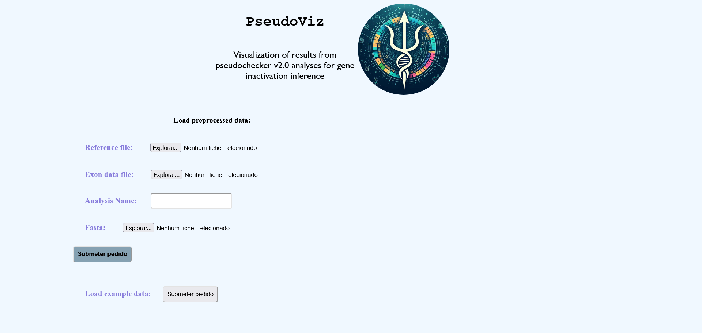
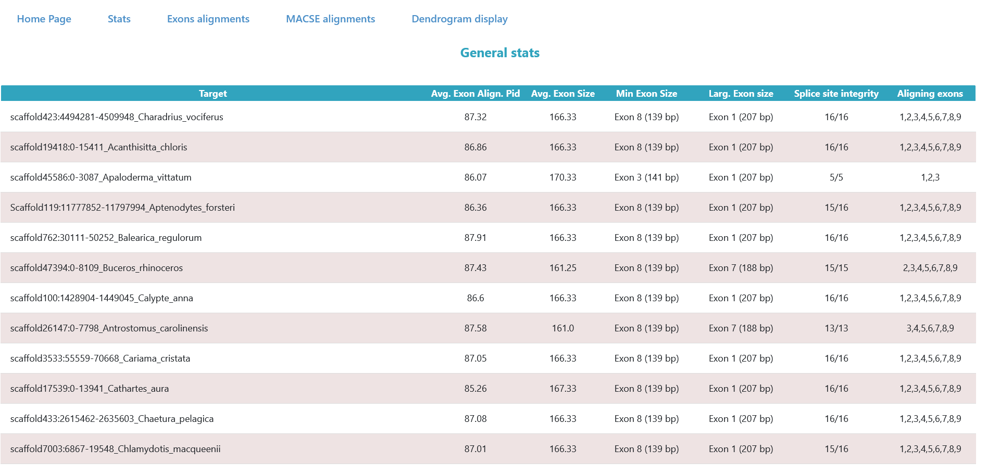
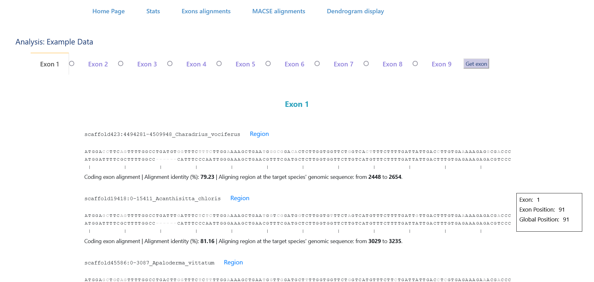
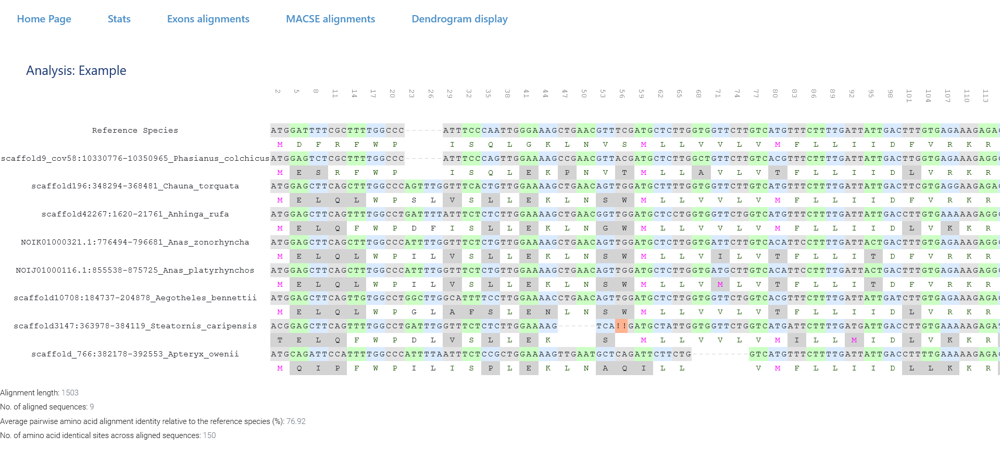
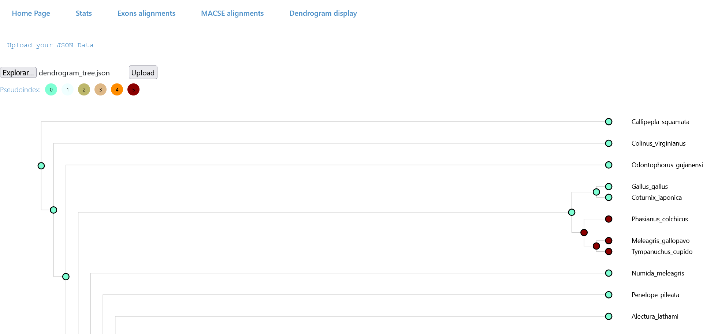

PseudoViz requires minimal user input, with just some of the output files from the PseudoChecker analysis. 

## Stats

The user will then be shown a set of comprehensive characteristics of the data, such as:
*the average percent identity of the exons relative to the reference sequence;
*the average size of the exons, the size of the smallest exon,
*the size of the largest exon, the integrity of splice sites (i.e. from the present splice sites, how many are conserved in the target sequence); 
*which exons from the reference aligned to the genomic sequence; per target, 
*the PseudoIndex metric, the percentage of the frame that is shifted due to a frameshift mutation, 
*the percentage of the frame that is truncated due to a premature stop codon, 
*the percentage of the frame that is missing based on the length of the exons that have not aligned on the genomic sequence; 
*finally, it shows details of each detected mutation. 

## Exon alignment display

In this page, the user can view exon alignments to the reference of a single exon at a time in multiple target sequences. 

Under each target display, the alignment percent identity of the target exon relative to the reference exon is shown, as well as the start and end of the aligned target exon on the genomic sequence.
By clicking on the Region link on each of the target displays in this page, the user is redirected to a page showing the position of exons in genomic region, where the exon sequences are highlighted in the middle of the target sequences. 

## MACSE alignments

In this page, the user can view a multiple sequence alignments with MACSE (Ranwez et al., 2011) for groups of species/targets of interest (e.g. one monophyletic clade in which several species present inactivating mutations).

## Results Dendrogram

PseudoViz also offers a way of visualizing the mutational events in phylogenetic context: a page displaying a dendogram with information on the mutations and PseudoIndex metric. In this dendogram, each nodes’ color corresponds to the assigned PseudoIndex metric. The PseudoIndex of the leaf nodes corresponds to the PseudoIndex of the target sequence to which that node corresponds. The PseudoIndex of the middle nodes corresponds to the minimum PseudoIndex of the child nodes. This does not represent an inferred state of the gene in common ancestors. Instead, it is designed to provide an easy overview of the erosion of the gene along a given phylogeny. When hovering over the nodes, a small text box will display the present mutations in the target or, in the case of the middle nodes, the mutations that are present in all its child nodes. Further details on the usage of PseudoChecker are available in the supplementary data 
